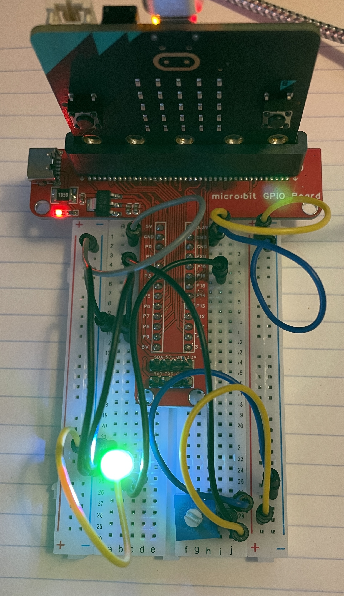

# rgbcal: RGB LED calibration tool

Greg Witt


## What Was Done

In this project I wired up my breadboard to the required specifications to achieve a potentiometer configuration that configures **4 States** that will affect an **RGB LED** wired into our system. 

**The 4 States Required**

1. When No Buttons are Held *(A, or B)*: the potentiometer adjusts the `frame_rate` of the `UiState` ensuring the LED is set to a range of `10..160`

2. When A Button is Held *(Only A button)*: the potentiometer adjusts the `blue` level of the RGB LED to ensure that it sets a state of `0..15` for the value of Blue within the LED

3. When B Button is Held *(Only B button)*: the potentiometer adjusts the `green` level of the RGB LED to ensure that it sets a state of `0..15` for the value of Green within the LED.

4. When A Button and B Button are Held *(Both Buttons)*: the potentiometer adjusts the `red` level of the RGB LED to ensure that it sets a state of `0..15` for the value of RED within the LED

I followed the supplied wiring specifications as mentioned in the project to achieve a baseline light color which is `White` ish to start the project.

### Wiring For Project

 

### Connections Made

**Bottom Left**

Connect the RGB LED to the MB2 on the bottom Left

[LED Wiring Diagram](https://docs.sunfounder.com/projects/sf-components/en/latest/component_rgb_led.html#:~:text=We%20use%20the%20common%20cathode%20one.&text=An%20RGB%20LED%20has%204,%2C%20GND%2C%20Green%20and%20Blue)


Red to P9 (GPIO1)
Green to P8 (GPIO2)
Blue to P16 (GPIO3)
Gnd to Gnd (From Both Sides of the Dragon Tail)


**Bottom Right**

Connect the potentiometer (knob) to the MB2 as follows: 

Pin 1 to Gnd
Pin 2 to P2
Pin 3 to +3.3V

### Code Comments 

I've documented the code to the best of my understanding for each of the four components used. I will provide a brief high level understand of each below in a few sentences.

### `main.rs`

The `main.rs` sets the ground work for our knob code to convert analog to digital signal sources and calibrates our knob to register interrupts with embassy when the modifications to the dial are made.

Apart from all of this the main connects our Mutex values which represent states of the running application and reflect our code changes to the `frame_rate` and the `rgb_levels` these levels are crucial to dialing in the white tone we are looking for. the threads are also joined for the `rbg` and the `ui` code to work in sync and share data accurately as we send interrupts to modify the code between the knob and the ui.

### `ui.rs`

the ui is extremely important to the fine configurations we will need in order to get the unique balances of `white` we desire. we leverage the `UiState` and the `Ui` structs here within this code. 

**Ui**

the `Ui` holds all of the board peripherals and is the main way users will interact with the board. the knob, buttons and state are all nested within the `Ui` struct and hold the modification attributes we will leverage and access to dial in the colors we desire. 

**UiState**

the `UiState`'s `show` method takes track of the main elements we care about holding the access to the `frame_rate` and the `levels` which are the current state of an array of 3 `u32` elements which represent the state of the `Red`, `Green` or `Blue` in terms of an integer within `0-15` this struct's `show` method is crucial for us. apart from the `knob` code which dials in all of the signal configurations.

### `rgb.rs`

the `rbg.rs` holds methods that we're primarily concerned with when it comes to calibration. `run` handles the setting of the `rgb_levels` from our `main.rs` and also the `frame_tick_time` to show the display of the led and modify it's refresh rate as needed. this is all handled with the `step` and `run` methods working together to establish a display functionality that wil modify our RGB led by the specified levels we choose.


### `knob.rs`

probably the most detailed, important but also simple struct throughout this code base. the `knob` is crucial for all measurements conducted by the `ui` from the user to calibrate their led to white with minute details the knob code calibrates each movement when being created with the constructor's `new` method and the crate magic of the `ADC` Analog to Digital Conversion which will take the position of the knob and translate the position into a digital signal that is measure able with the `measure method`


## Measurements:

### Green Measurements:

Minimum Acceptable:

**Max Red/Blue**

`red: 15`                                                
`green: 4`                                               
`blue: 15`                                               
`frame rate: 40`

**Moderate Red/Blue**

`red: 7`
`green: 12`
`blue: 7`
`frame rate: 50`


### Blue Measurements: 

Minimum Acceptable:

**Max Green/Red**

`red: 15`
`green: 15`
`blue: 8`
`frame_rate: 40`

**Moderate Green/Red**

`red: 4`
`green: 12`
`blue: 11`
`frame_rate: 50`

## How Development Went

the development process was a bit slow. After I connected all of the wires and established the appropriate understanding of how the code worked I was able to see the relationship the `main` method and the `ui` of sharing state and developing a location inside of the `ui` where I was able to develop a solution that was able to keep track of the position of the knobs and also modify the levels of the rbg leds. 

**LED Adjustment Logic**

basically within the `run` calls of the `ui`. this logic however unimpressive is what will leverage the ability for the buttons of each required spec to detect the changes required to ensure the RED, GREEN, and BLUE. fields are changed based on the behavior of the UI. this seemed fairly intuitive and easier to modify than other interrupt logic we've written in the past for the drop assignments and has made me consider leveraging embassy in my personal projects. due to the simplicity of the run code it allows to ensure the knob is changed and measured.

```rust
// checks the state of the A button for BLUE changes
    if self._button_a.is_low() && !self._button_b.is_low() {
        rprintln!("A button held modify");
        rprintln!("modify BLUE LED");
        let level = self.knob.measure().await;
        if level != self.state.levels[2] {
            self.state.levels[2] = level;
            self.state.show();
            set_rgb_levels(|rgb| {
                *rgb = self.state.levels;
            })
            .await;
        }
    }
    // checks the state of the B button for the GREEN changes
    else if !self._button_a.is_low() && self._button_b.is_low() {
        rprintln!("B button held modify");
        rprintln!("modify GREEN LED");
        let level = self.knob.measure().await;
        if level != self.state.levels[1] {
            self.state.levels[1] = level;
            self.state.show();
            set_rgb_levels(|rgb| {
                *rgb = self.state.levels;
            })
            .await;
        }
    }
    // Checks if both A and B states for the RED changes
    else if self._button_a.is_low() && self._button_b.is_low() {
        rprintln!("A & B button held");
        rprintln!("modify RED LED");
        let level = self.knob.measure().await;
        if level != self.state.levels[0] {
            self.state.levels[0] = level;
            self.state.show();
            set_rgb_levels(|rgb| {
                *rgb = self.state.levels;
            })
            .await;
        }
    }
                // checks the state of both A and B to ensure FRAME_RATE 
    // changes occur when both are not touched and the knob is moved.
    else {
        rprintln!("adjust the frame-rate based on the position of the knob");
        let mut frame_rate = self.knob.measure().await * 10;
        if frame_rate == 0 {
            frame_rate = 10;
        }
        set_frame_rate(u64::from(frame_rate)).await;
        self.state.frame_rate = u64::from(frame_rate);
        self.state.show();
    }
```

**LED Frame Rate and Accessing Levels**

in order to leverage the ability to change the levels and frame rate for the ui. additional setters and accessors were required to allow for the state to be modified without too many things going wrong and crashing. 

```rust
// Mutex to hold the frame rate of the UI State Component
pub static FRAME_RATE: Mutex<ThreadModeRawMutex, u64> = Mutex::new(100);
```

in order to make modifications in a civilized fashion adding the get_frame_rate and set_frame_rate made this easier for ensuring everything remains behaviorally normal when making the adjustments. with the assurance of Rust's lock system for the async method. to prevent deadlocks and race conditions.

```rust
// accessor method to get the frame_rate from the UiState 
async fn get_frame_rate() -> u64 {
    let frame_rate = FRAME_RATE.lock().await;
    *frame_rate
}

// setter used to modify the frame rate within the UiState
async fn set_frame_rate(incoming_rate: u64)
{
    let mut frame_rate = FRAME_RATE.lock().await;
    *frame_rate = incoming_rate;
}
```

this was already leverage for the Led levels and made the most sense to me to modify the levels and the frame rate consistently.

## Build and Run

Run with `cargo embed --release`. You'll need `cargo embed`, as
`cargo run` / `probe-rs run` does not reliably maintain a
connection for printing. See
https://github.com/probe-rs/probe-rs/issues/1235 for the
details.
